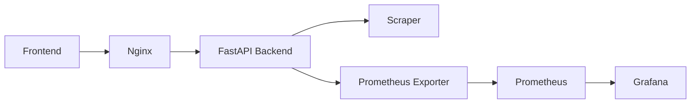

# AIR-scrappy

Production‑grade scraper skeleton:
- FastAPI backend with Playwright‑ready rendering, robust HTML/JSON extraction, rate limiting, CORS, and Prometheus metrics
- React + Vite single‑page admin UI for testing and inspecting outputs
- Docker Compose with Prometheus + Grafana for basic monitoring

## Key features

- Robust extraction from `__NEXT_DATA__` with safe HTML fallbacks
- Optional Playwright rendering, image and amenities enrichment
- Amenity normalization with synonyms and fuzzy matching
- Built‑in rate limiting, CORS, health, and Prometheus metrics
- Lightweight React admin to validate and inspect results
- Dockerized dev/prod flows; CI for tests and frontend build

### Frontend features

- URL input with enter-to-run, plus one-click sample URL
- Toggle between actions: Extract (raw) vs Map (normalized to Rentals United)
- API base URL override and optional `X-API-Key` header toggle
- Robots.txt quick preview for the entered URL’s host
- Result Summary, Photo grid, Amenities list (raw and normalized)
- JSON output viewer with tabs
- Run history with per-run timing and status, and summary statistics
- Top progress indicator and side navigation for sections

## Quickstart (local dev)

Backend (Python 3.11+):

```bash
cd backend
python3 -m venv .venv
source .venv/bin/activate
pip install -r requirements.txt
# optional for dynamic content rendering:
# python -m playwright install chromium --with-deps
pytest -q
uvicorn app:APP --reload --port 8000
```

Frontend:

```bash
cd frontend
npm install
npm run dev
```

Docker Compose (backend, frontend, Prometheus, Grafana):

```bash
docker compose up --build
```

Frontend will be served on http://localhost:5173 and proxy API requests to the backend.

## Architecture



## Environment variables

Backend (set via shell or `.env` referenced by `compose.yaml`):

| Name | Default | Description |
|------|---------|-------------|
| `API_KEY` | empty | If set, require `X-API-Key` header on protected endpoints |
| `ALLOWED_ORIGINS` | `http://localhost:5173,http://localhost:5174,http://localhost:5175` | CORS allowlist |
| `RATE_LIMIT` | `60/minute` | Global rate limit (SlowAPI format) |
| `PLAYWRIGHT_TIMEOUT` | `15` | Seconds for navigation/render timeout |
| `MAX_IMAGES` | `25` | Max images to enrich via Playwright |
| `USER_AGENT_POOL` | empty | JSON array of UAs to rotate |
| `HTTP_PROXY`/`HTTPS_PROXY` | empty | Proxy to use for Playwright |

Frontend:

| Name | Default | Description |
|------|---------|-------------|
| `VITE_API_BASE` | `/api` | Base URL for API requests |

> Tip: If you don’t keep an `.env` in the repo, export these in your shell or your CI variables.

## API

- `GET /healthz` → `{ status, browser, contexts }` (reports Playwright/browser readiness)
- `GET /metrics` → Prometheus metrics (via `prometheus-fastapi-instrumentator`)
- `GET /robots-check?url=` → Fetches and previews `robots.txt` for a host
- `POST /api/extract` with body `{ "url": "..." }` → Extracts raw listing data
- `POST /api/map/rentals-united` with body `{ "url": "..." }` → Normalized Rentals United shaped output

Send `X-API-Key` header when `API_KEY` is set.

Example:

```bash
curl -s -X POST \
  -H "Content-Type: application/json" \
  -H "X-API-Key: $API_KEY" \
  -d '{"url":"https://www.airbnb.com/rooms/1211031564000709008"}' \
  http://localhost:8000/api/extract | jq .

# Alternate style URL also works
curl -s -X POST \
  -H "Content-Type: application/json" \
  -d '{"url":"https://airbnb.com/h/irtahal-apartment57"}' \
  http://localhost:8000/api/extract | jq .
```

## What data is extracted

The backend returns an `ExtractedListing` (raw) or `RUListing` (normalized). Core fields include:

- Title, description
- Address: full, street, city, state, postal_code, country, lat, lng
- Photos: URL, width, height, caption (deduplicated, filtered, max 25)
- Amenities: `amenities_raw` (as found) and `amenities_normalized` (canonical)
- Capacity: bedrooms, beds, bathrooms, max_guests
- Types: `property_type_raw`, `room_type_raw`
- Rating, currency, base_price
- Host: name, superhost, response_rate, response_time
- Source: `airbnb`, canonical_url, fetched_at

Extraction strategy:
- Prefer `__NEXT_DATA__` JSON when present for high-fidelity fields
- Fallback to DOM parsing when JSON is absent
- Opportunistic Playwright use to load dynamic pages
- Image enrichment: capture network image requests and DOM `img/srcset`, scroll to trigger lazy loads

Amenity detection and normalization:
- Synonym pre-map via `ru_mapper/data/amenities_synonyms.json`
- Fuzzy match remaining items to canonical taxonomy (`amenities_taxonomy.json`) using RapidFuzz
- Conservative threshold (token_set_ratio ≥ 88) to avoid false positives
- Optional Playwright flow opens the amenities modal and scrapes visible items while filtering obvious noise

## Monitoring

- Prometheus runs at http://localhost:9090 and scrapes backend `/metrics`
- Grafana runs at http://localhost:3000 (admin/admin by default) with a Prometheus datasource pre‑provisioned

## Testing

```bash
cd backend
python3 -m venv .venv && source .venv/bin/activate
pip install -r requirements.txt
pytest -q
```

### Frontend testing

Manual QA (development server):

```bash
cd frontend
npm install
npm run dev
# open http://localhost:5173
# 1) Paste an Airbnb listing URL
# 2) Choose Extract (raw) or Map (normalized)
# 3) Optionally set API base and X-API-Key in the Controls panel
# 4) Verify Robots preview, Summary, Photos, Amenities, and JSON tabs populate
```

Production build sanity check:

```bash
cd frontend
npm ci
npm run build
npm run preview -- --host
# open the served URL, repeat steps above
```

## Build production images (optional)

```bash
docker compose build
# or single services
docker build -t air-scrappy-backend ./backend
docker build -t air-scrappy-frontend ./frontend
```

## Notes & guidelines

- Respect site TOS and robots; do not use this for unauthorized scraping
- Playwright is used selectively when dynamic rendering is required
- Rate limiting and CORS are enabled; tune via env vars above
- Metrics are exposed for minimal observability; extend as needed

## Sample URL
## Troubleshooting

- macOS “externally-managed-environment” error: create a venv and use `pip --break-system-packages` if needed.
  ```bash
  cd backend && python3 -m venv .venv && source .venv/bin/activate
  pip install -r requirements.txt --break-system-packages
  ```
- Playwright missing browsers: `python -m playwright install --with-deps chromium`
- Ports already in use: change ports in `compose.yaml` or stop conflicting services.
- API 401: set `API_KEY` and pass `X-API-Key` header from the UI or curl.

## Roadmap

- Pre-commit (ruff/black/isort/mypy) + CI lint step
- Stronger extraction heuristics and additional fixtures
- Proxy rotation and stealth strategies
- Grafana dashboards for latency/error/throughput
- Frontend UX improvements (copy/download JSON, dark mode)

